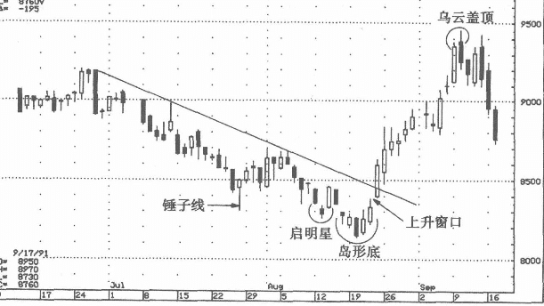
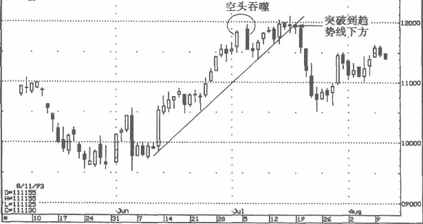

## 趋势-上坡难下坡昮
在趋势中判定价格的高低是非常重要的。也就是说，在决定新建一个仓位以前，应把当前的蜡烛图组合形态放在行情走势的大背景中来考虑。

### 顺着趋势的方向下单交易
如何把蜡烛图形态结合到行情趋势中？我的建议通常是：顺着趋势的方向下单交易，反转信号出现后冲销既有头寸。举例来说:
* 在上升趋势中如果出现空头信号，就要冲销既有的多头头寸（或采取其他保护性措施，包括卖出买人期权，调高卖出（止损）价位）。
* 上升趋势如出现多头信号，则可以建立新的多头头寸。
* 在大幅下降趋势中，操作恰好相反。具体说来就是，在熊市中，主要应等待空头信号，一旦出现就建立新的空头头寸；熊市中的多头信号也可辅助使用，即一旦出现也许就可以考虑平仓既有的空头头寸。

### 趋势线是判断趋势的最基本方法之一
在图4~7中，从6月下旬到8月上旬之间构成了一条压力线，使得市场一路走熊。然后有多根蜡烛图发出正在筑底的预警信号，具体说来，它们包括：7月的锤子线、8月上旬的启明星、8月下旬的上升窗口（它使得一个岛形底部得以完成）。但是要注意，所有这些向好信号发生的背景是一个熊市市道（体现那条向下延伸的压力斜线（下降趋势线，也是下降压力线）。只有当行情突破了这条趋势线之后，一个新的多头趋势才获得了确认，行情开始向上攀升，但受阻于9月，形成一个乌云盖顶，而这个乌云盖顶形态又成为后续走势的阻力位。

### 例子
如图4-8所示，7月初形成了一个空头吞噬组合（两根蜡烛线中间出现空档是因为当时正逢假日）。如果看一下整体技术面状况，包括那条趋势线，可以看出，如果根据这个空头吞噬而卖空，那么收益风险比明显过低，因为平仓的目标价位理论上是上升趋势线所构成的支撑位，止损点则在空头吞噬的上端。后来的行情发展证明，一直到7月19日收盘价到达趋势线下方时，这条构成支撑的上升趋势才被确认跌破。

## 随机应变者胜-就是要顺应市场情况调整自己
下单交易，就意味着你对市场的趋势有了自己的期待和判断。但是，市场如水，瞬息万变。因此，你必须持续关注行情的演变轨迹，以确定价格的变动是否符合你的预期。如果市场的发展出乎你的意料，就必须采取恰当的对策。

就是要顺应市场情况调整自己，迅速而有效地适应新的市场环境，是成功交易的关键。

数年前我听到过一个很恰当的比喻，将交易比做比剑决斗。比剑决斗的结果，有生有死；交易的结果也是有生有死。在英语中，quick一词有两个意思，一是“迅速”，一是“活着”。在比剑决斗中，你必须反应敏捷，否则就可能丧命。交易也一样。迅速地因应市场的情况，调整自己，这样才能“活下来”继续从事交易。

在图4-12中，12月下旬的吊颈线与空头吞噬（中间的空档是假日）确认20美元附近是个阻力位。在这个区域，价格开始下滑，1月上行情在前一个月形成的19美元附近支撑位试图企稳。但是，1月12日的长黑实体跌破了19美元的支撑位。至此，所有的信号都是负面的。但是，长黑实体之后的高浪线发出蜡烛图信号，提示市场可能“变脸”。 
下一周，盘面又形成启明星形态，再次提示应该改变此前的看空判断。此后出现上升窗口，成为市场逆转的最后一个证据。